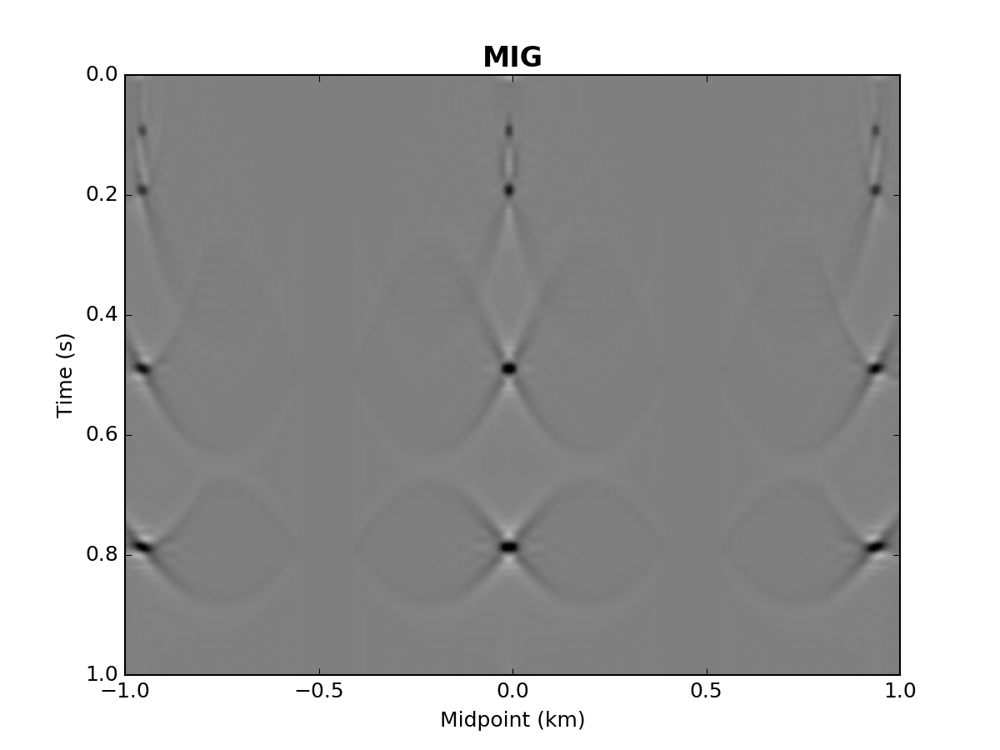
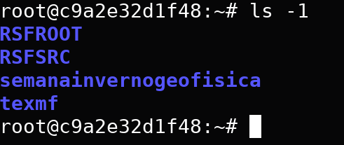

> **Clone o repositório!**  Em um terminal digite:

>  `git clone https://github.com/brunopdias/semanainvernogeofisica.git`

---------------------------------

[Least-Squares Migration](README_LSM.md)
=========================
**X Semana de Inverno de Geofísica: 22 a 24 de Julho/2019 — INCT-GP, UNICAMP, Campinas, SP**

**André Bulcão, Bruno Pereira Dias e Djalma Manoel Soares Filho**

|   |   | 
|---|---|
|  |  |

---------------------------------

[Point Spread Function: Aplicações na Geofísica](README_PSF.md)
================================================
**VIII Semana de Inverno de Geofísica: 19 a 21 de Julho/2017 — INCT-GP, UNICAMP, Campinas, SP**

**André Bulcão, Bruno Pereira Dias e Djalma Manoel Soares Filho**


---------------------------------

[Full Waveform Inversion: Introdução e Aplicações](README_FWI.md)
================================================
**VII Semana de Inverno de Geofísica: 6 a 8 de Julho/2016 — INCT-GP, UNICAMP, Campinas, SP**

**André Bulcão, Bruno Pereira Dias e Djalma Manoel Soares Filho**


---------------------------------

Pré-Requisitos / Instalação do Sistema
--------------------------------------

1. [Git](https://git-scm.com/):
`sudo apt-get install git` (ubuntu)
2. [GNU Octave](https://www.gnu.org/software/octave/): `sudo apt-get install octave` (ubuntu)
3. [Suitesparse](http://faculty.cse.tamu.edu/davis/suitesparse.html): `sudo apt-get install libsuitesparse-dev` (ubuntu)
4. [Madagascar](http://www.ahay.org/):
 [Download](http://www.ahay.org/wiki/Download), [Pré-Requisitos](http://www.ahay.org/wiki/Advanced_Installation#Platform-specific_installation_advice), [Instalação](http://www.ahay.org/wiki/Installation), [Tutorial](http://www.ahay.org/wiki/Tutorial)

> **Atenção!** É necessária a instalação da versão em desenvolvimento do Madagascar:

> `git clone https://github.com/ahay/src RSFSRC`

---------------------------------

Pré-Requisitos via Docker
---------------------

Com Docker instalado em sua máquina, entre no diretório clonado e digite:

```bash
docker build -t semanainvernogeofisica . 
```

**Entrando no contêiner**:

```bash
docker run -it semanainvernogeofisica
```

Navegue entre as pastas via terminal




**Habilitando Interfaces gráficas (GUI) no contêiner**:

```bash
docker run -it -v /tmp/.X11-unix:/tmp/.X11-unix -e DISPLAY semanainvernogeofisica
```

> **Obs**: Caso sinta falta de alguma biblioteca, é possível editar o Dockerfile de acordo com sua necessidade. A imagem é baseada no Ubuntu 18.04.
