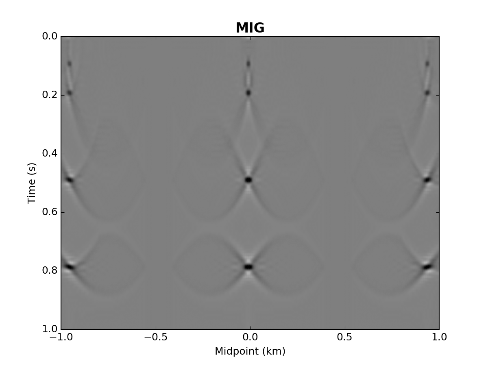
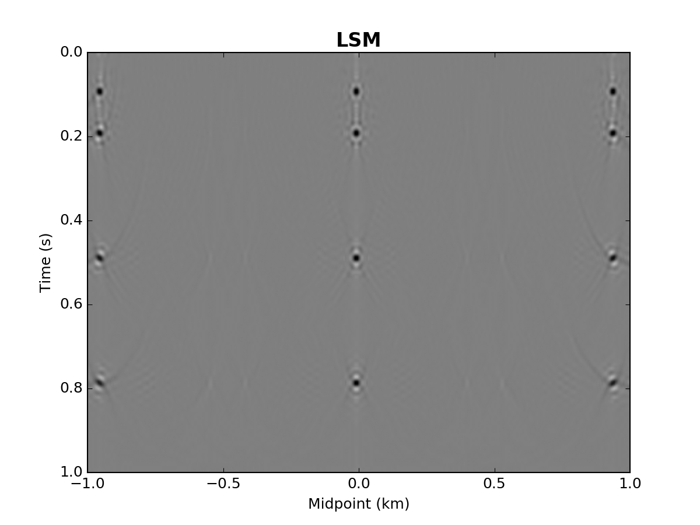

Point Spread Function: Aplicações na Geofísica
================================================
**X Semana de Inverno de Geofísica: 22 a 24 de Julho/2019 — INCT-GP, UNICAMP, Campinas, SP**

**André Bulcão, Bruno Pereira Dias e Djalma Manoel Soares Filho**

|   |   | 
|---|---|
|  |  |

 ---------------------------------

Ementa do Curso
---------------

#### Dia 1

- **Módulo 1:** Introdução & Motivação
  

- **Módulo 2:** 
  

#### Dia 2

- **Módulo 3:** 
  
- **Módulo 4:** 
  

---------------------------------

Referências
-----------

**Livros**

* SCHUSTER, G.T., *Seismic Inversion*. Society of Exploration Geophysicists: 2017. [Link](https://library.seg.org/doi/book/10.1190/1.9781560803423)

**Artigos**

* HU, J., SCHUSTER, G. T., VALASEK, P. A., *Poststack migration deconvolution*. Geophysics, v.66, no.3, 2001.

* LECOMTE, I., *Resolution and illumination analyses in PSDM: A ray-based approach*. The Leading Edge, May 2008.

* FLETCHER, R., NICHOLS, D., BLOOR, R., COATES, R.T., *Least-squares migration - Data domain versus image domain using point spread functions* The Leading Edge, February 2016.

**Teses**

* TAKAHATA, A. K., *Unidimensional and Bidimension Seismic Deconvolution*. Tese de Doutorado. UNICAMP, 2014.

* FARIAS, F. F., *Migração Reversa no Tempo com Amplitude Ponderada pela Iluminação*. Dissertação de Mestrado. COPPE/UFRJ, 2015.

* SOUZA, A.A.V.B., *Migração Sísmica por Quadrados Mínimos utilizando Funções Robustas*. Dissertação de Mestrado. UNICAMP, 2017.

---------------------------------

Recursos Externos
-----------------

##### Madagascar: [Site](http://ahay.org/wiki/Main_Page/), [Repositório](https://github.com/ahay/)

- Modelagem acústica/elástica 2D/3D tempo: sfawefd2d, sfawefd3d, sfewedf2d, sfewefd3d
- Modelagem/inversão acústica 2D frequência: sfhelmlu, sfhelm2D_fwi

##### [A numerical tour of wave propagation](http://www.reproducibility.org/RSF/book/xjtu/primer/paper_html/) por Pengliang Yang

---------------------------------

Recursos Externos (Youtube)
--------------------------
- [EAGE E-lecture: Least Squares Reverse Time Migration by Bin Wang](https://www.youtube.com/watch?v=PZEHGpiZJAY)
