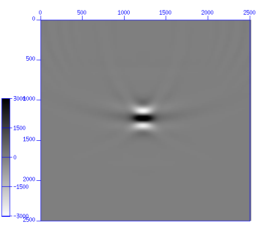

Point Spread Function: Aplicações na Geofísica
================================================
**VIII Semana de Inverno de Geofísica: 19 a 21 de Julho/2017 — INCT-GP, UNICAMP, Campinas, SP**

**André Bulcão, Bruno Pereira Dias e Djalma Manoel Soares Filho**

---------------------------------

Ementa do Curso
---------------

#### Dia 1

- **Módulo 1:** Introdução & Motivação
  - Definição e Aplicações
  - Casos da Literatura
  - Revisão do Método Sísmico
  - Modelagem Sismica
    - Diferenças Finitas, Traçado de Raio
    - Elasticidade, Anisotropia, Absorção
  - Migração Sísmica: RTM , Kirchhoff , outros

- **Módulo 2:** Conceitos Básicos
  - Convolução unidimensional e multidimensional
  - Operadores Lineares e Operador Adjunto
  - Métodos Iterativos de Inversão Linear
    - Método do Conjugado Gradiente
    - Método do Conjugado Gradiente Quadrados Mínimos
    - Outros Métodos (LSQR, LSMR...)
  - Técnicas de Regularização
    - Regularização de Tikhonov
    - Vínculos de Esparsidade

#### Dia 2

- **Módulo 3:** [Cálculo da PSF](psf)
  - Traçado de Raio + Filtro KK
  - Modelagem de Born + Migração (RTM)
  - Modelagem por Ponto Focal

- **Módulo 4:** Exemplos de Aplicações
  - Iluminação e suporte à interpretação pela análise das PSFs
  - Modelagem da resposta sísmica
  - Estudo de Viabilidade 4D
  - Least Squares Migration Image Domain (LSM-ID)
    - Acústico
    - Pré-empilhamento
    - Inversão 4D
    - Correção da Atenuação
    - Elástico

---------------------------------

Referências
-----------

* JANSSON, A. P., *Deconvolution of Images and Spectra*. 2a. Ed. Academic Press: 1996.

* FLETCHER
* CAVALCA
* SCHUSTER

* ALAN
* KAZUO

---------------------------------

Recursos Externos
-----------------

##### Madagascar: [Site](http://ahay.org/wiki/Main_Page/), [Repositório](https://github.com/ahay/)

- Modelagem acústica/elástica 2D/3D tempo: sfawefd2d, sfawefd3d, sfewedf2d, sfewefd3d
- Modelagem/inversão acústica 2D frequência: sfhelmlu, sfhelm2D_fwi

##### [A numerical tour of wave propagation](http://www.reproducibility.org/RSF/book/xjtu/primer/paper_html/) por Pengliang Yang

##### [Homepage of Jan Thorbecke](https://janth.home.xs4all.nl/)

- [Repositório](https://github.com/JanThorbecke/OpenSource)
- [Modelagem 2D acústica/visco-elástica](https://janth.home.xs4all.nl/Software/Software.html)
- [Curso HPC](https://janth.home.xs4all.nl/HPCourse/index.html)

#### [Zeiss: Point Spread Function](https://www.zeiss.com/microscopy/us/solutions/reference/basic-microscopy/the-point-spread-function.html)

---------------------------------

Recursos Externos (Youtube)
--------------------------

- [Microscopy: Point Spread Function (Jeff Lichtman)](https://www.youtube.com/watch?v=JQy94K94nL0)

- [EAGE E-Lecture: Q-Compensation through Depth Domain Inversion, by Maud Cavalca](https://www.youtube.com/watch?v=UD0GKXnj2YA)

- [EAGE E-lecture: Least Squares Reverse Time Migration by Bin Wang](https://www.youtube.com/watch?v=PZEHGpiZJAY)
