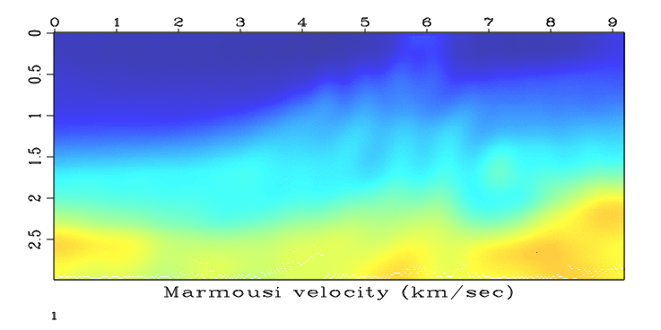

Full Waveform Inversion
=======================

[helm2D](helm2D)
----------------

Código de inversão no domínio da frequência obtido de https://github.com/ahay/src/tree/master/user/hzhu com pequenas modificações relacionadas a busca linear e liberação de memória.

> **Execute no diretório helm2D:** `scons`

Após a compilação do programa, confira a existência dos seguintes executáveis:

  - `sfhelm2D_bornsyn`: modelagem de Born
  - `sfhelm2D_forward`: modelagem direta
  - `sfhelm2D_fwi`: FWI no domínio da frequência
  - `sfhelm2D_genrec`: gera arquivo de receptores
  - `sfhelm2D_genshot`: gera arquivo de fontes
  - `sfhelm2D_lsm`: migração por mínimos quadrados
  - `sfhelm2D_rtm`: migração reversa no tempo

[shell](shell)
--------------

> **Confira os parâmetros do modelo:** `sfin < marmvel.rsf`

```bash
in="marmvel.bin"
esize=4 type=float form=native
n1=150         d1=0.02        o1=0          
n2=460         d2=0.02        o2=0          
	69000 elements 276000 bytes```

> **Forneça permissão de execução:** `chmod 755 commands.sh`

> **Execute o shell script:** `./commands.sh`


