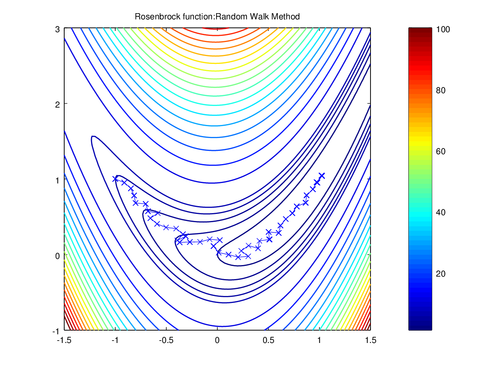
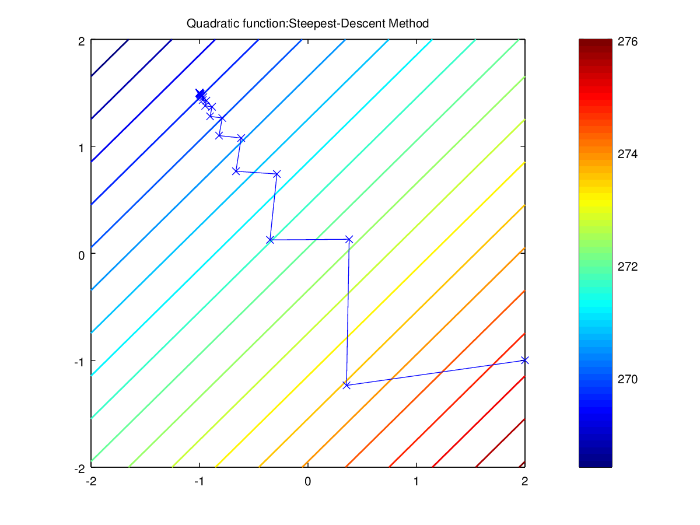

Modelagem
=========

Exemplos: [octave](octave)
--------------------------

**Execute no diretório:** `octave`
```matlab
octave:1> objective_function
Choose Objective function:
1-> Quadratic; 2-> Rosenbrock: 2


octave:2> random_walk
sopt = Random Walk Method
Give the first component of initial point : -1
Give the second component of initial point: 1
Give the step length:0.1
Give the minimum allowable step length: 0.001
Maximum number of iterations: 1000
The optimum point is:

   1.0206   1.0442
The optimum value is:

   4.9034e-04

octave:3> plot_obf
```



Exemplos: [matlab](matlab)
--------------------------
A conversão dos scripts *octave* para *Matlab* foi realizada pelo **Felipe Timóteo da Costa**

**Execute no Matlab:
```matlab
>> steepest_descent
sopt = Steepest-Descent Method
Give the starting point: first component: 2
Give the starting point: second component: -1
Choose Objective function:
1-> Quadratic; 2-> Rosenbrock:1
Number of iterations:
 53
Solution:
  -1.00000   1.50000
Function value:
-1.2500
Norm of fprime:
   8.2497e-07

>> plot_obf

```


